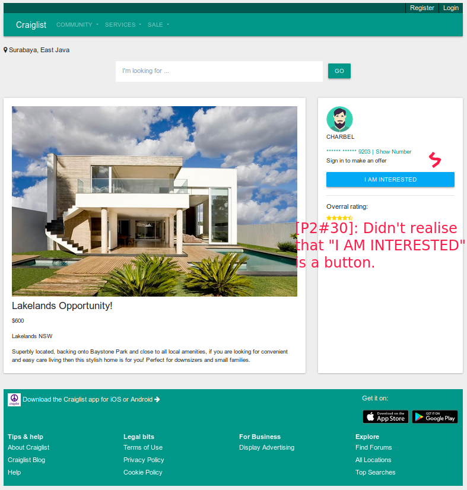

# Usability Evaluation and Prototyping (again)
> Usability Evaluation in this assignment is to evaluate your high-fidelity interactive-prototype with two participants:
> the participant from the previous Contextual Inquiry (CI) 
> and an additional novice-participant with different demographics if possible.
> Respectively, revise your prototype as an attempt to fix any problems found in this Usability Evaluation.

## Operating the Prototype
> Record a video (screen-recording is preferred) while you operating your prototype.
> Present the ideal case on how to interact with the prototype from the beginning to the end.
> Upload the video on any video-sharing website (e.g., YouTube), then attach the video link on this report.

---

## Part A: Usability Evaluation
> In this part, you should prepare your high-fidelity interactive-prototype from the assignment 2.
> Invite the participant from your previous CI to test the prototype.
> You also need to invite one more novice participant.
> As with the CI, you might need to videotape your sessions.
> You can benefit from the videotape while writing your `Recording Transcript` later.

### 1. Brief Description of Participants
> Describe your participants in bullets or sentences.
> The description should contain their demographic (age, gender, occupation),
> their skill level in using the system, and your reasons choosing them.
> The description should NOT contain any personally identifiable information.

#### a. Description of Participant 1
I chose this participant because he comes from a non-tech social background, and I would like his perspective about the redefined Craiglist UI in his own terms. Tech updated people tend to know basic conventions of operations, while non-tech don't. So I think it would be interesting to do so. 
 - Social science student
 - Male, 21 years of age
 - Never heard of Craiglist
 - Light internet usage for daily work  

#### b. Description of Participant 2
Lorem Ipsum is simply dummy text of the printing and typesetting industry. Lorem Ipsum has been the industry's standard dummy text ever since the 1500s, when an unknown printer took a galley of type and scrambled it to make a type specimen book.

### 2. Evaluation Script
> Write the questions you ask and the instructions you use to direct the participants on what to do.
> If it is the same as previous assignments, please mention this, yet go ahead and INCLUDE it again,
> so we have everything in one place.
> Note that the evaluation script must include exactly what you plan to say to the participants.

1. Register an account.
2. Find a housing ad, its description, the location of the house, and the phone number of the ad lister.
3. Use the search feature to find the cheapest Samsung mobile phone.

### 3. Transcript
> Provide a summary of what the participant did and said, and what you did and said.
> If at some points you have to help the participants, because they cannot figure out what to do,
> that scene must be included in the transcript.
> It is not necessary to write down every word the participant said,
> just what is interesting and useful.
> Ensure to write down all the actions on the device, whether correct or wrong.
> Remember to supplement the transcript with time-codes or line-numbers.

#### a. Transcript with Participant 1
 1. **You**: Terima kasih sudah menyediakan waktu untuk berpartisipasi dalam uji coba prototype saya.
 2. **You**: Yang ada didepan kita sekarang adalah bentuk prototype website Craiglist. Craiglist adalah website yang menyediakan barang bekas untuk dibeli dan dijual, serta forum untuk berdiskusi. Anda pernah mendengar Craiglist sebelumnya?
 3. **Participant**: Belum pernah.
 4. **You**: Ok, saya akan memberikan laptop saya agar anda bisa mengoperasikannya. Apa yang anda lihat sekarang?
 5. **Participant**: Hmm.. Dari hasil tampilan, saya rasa ini halaman landing page ya? Ada tombol Login dan Register diatas, ada navigasi atas, ada search, ada bagian Automotives, Community, Housing, Service, ada bentuk kotak-kotak yang berisi gambar mobil. Itu iklannya kah?
 6. **You**: Iya sip. Ok, pertama saya akan menyuruh anda untuk registrasi akun. Kalau bisa setiap step di-verbal kan ya.
 7. **Participant**: Ok, saya pertama klik Register account yang diatas. Ini halamannya beralih. Disini saya disuru mengisi email dan password. Lalu klik submit. Ada 2 tulisan yang muncul, di kotak Email Address ada tulisan "You can use this email address" dengan centang hijau, sedangkan di "Password", ada tulisan "Password needs to have capital letter" dengan warna merah. Berarti Email saya sudah benar, sedangkan Password harus diperbaiki. Nah hmm.. Saya klik Submit lagi. Oh ini ada halaman yang berisi "Congratulation (*email saya*) you have successfully registered."
 8. **You:** Ok, apakah anda menemukan kesulitan untuk mendaftar akun?
 9. **Participant:** Menurut saya tampilan sudah cukup bagus, dan mudah untuk mendaftarkan akun.
 10. **You:** Tadi kan sempat muncul tulisan untuk membantu email dan password. Itu dibutuhkan ndak kira-kira?
 11. **Participant:** Menurut saya tulisannya cukup jelas karena saya tahu apa yang harus diperbaiki di password, dengan warna merah... berarti salah. Jadi saya ganti password dengan huruf kapital.
 12. **You:** Sekarang tolong untuk mencari advertisement rumah di halaman utama.
 13. **Participant:** Ini sudah saya klik...
 14. **You:** Terdiri dari apa saja?
 15. **Participant:** Disini ada gambar rumahnya, info penjualan.
 16. **You:** Coba untuk mendapatkan info lebih lanjut untuk rumah tersebut.
 17. **Participant:** Sudah.. Ini ada gambar rumahnya, harga, info, sama kotak penawaran di sebelah kanan.
 18. **You:** Coba anda cari contact person rumah tersebut.
 19. **Participant:** Oh jadi ini, kalau saya klik tombol "I'm interested" ehhh saya tahu profil dari orang penjual rumah ini, ada nama, no telp dan alamat, beserta map lokasi penjual tersebut.
 20. **You:** Ok, apakah anda mengalami kesulitan ketika mencari rumah beserta info penjual?
 21. **Participant:** Kalau saya tidak terlalu sulit untuk mencari, karena langkahnya sudah jelas dan simple. Bisa ditebak.
 22. 

#### b. Transcript with Participant 2
 1. **You:** Uji coba pertama aku akan menyuru kamu untuk registrasi akun. Setiap step yang kamu lakukan tolong untuk di-verbal kan.
 2. **Particiapant:** Ok aku klik register di nav bar. Aku dibawa ke halaman baru. Oh mudah ini, sekarang aku mengisi email dan password aku. Lalu aku klik submit. Tapi disini aku harus mengubah password... 
 3. **You:** Yang muncul apa?
 4. **Participant:** Ada tulisan "password needs to have capital letter".. Ada warna merah di box password, untuk email bisa digunakan, ada tulisan dan warna hijau. Sekarang aku submit lagi.
 5. **You:** Sekarang udah sampai mana?
 6. **Participant:** Tampilan yang ada didepan aku menunjukkan bahwa aku sudah bisa menggunakan Craiglist dengan akun baru. Mantapp mas.
 7. **You:** Ok, tampilannya bisa dipahami? Terus tadi kan sempat muncul pesan ya. Menurut kamu apa tadi membantu anda untuk melakukan registrasi.
 8. **Participant:** Udah cukup kok untuk memberitahu registrasi sudah selesai... Hmm iya membantu. Membantu meningat aku untuk ganti password dengan ada huruf besar, tidak kecil semua.
 9. **You:** Terus tadi kan ada warnanya, hijau dan merah. Apakah itu mengikat perhatian?
 10. **Participant:** Ketika aku melihat warna merah, aku langsung tahu ada yang salah.
 11. **You:** Ok. Sekarang coba ke halaman utama. Apa yang bisa kamu lihat?
 12. **Participant:** Ini ada iklan-iklan mobil. Kotaknya besar-besar, gampang dibaca. Banyak pilihannya juga, bisa milih kategori beda.
 13. **You:** Ok, ada yang kurang ndak menurutmu?
 14. **Participant:** Ini ukuran kepanjangan deskripsi iklan ada yang beda-beda, jadi ada yang ndak sejajar.
 15. **You:** Okee. Step selanjutnya coba kamu cari iklan rumah.
 16. **Participant:** Ok aku klik tombol rumah. Ada 4 tipe rumah yang ada.
 17. **You:** Sekarang cari informasi untuk salah satu rumah yang kamu tertarik.
 18. **Participant:** Sudah.
 19. **You:** Sekarang kamu di halaman apa?
 20. **Participant:** Di halaman penjualan.
 21. **You:** Ada apa saja?
 22. **Participant:** Ini ada gambar rumah, nama iklan, harganya sama informasi tambahan. Terus di sebelah kanan ada persegi yang berisi profil penjual, dan nomer HP tapi ndak lengkap.
 23. **You:** Harga rumahnya berapa?
 24. **Participant:** 600 dollar.
 25. **You:** Kamu sekarang cari nomer contact person berserta lokasi orang nya.
 26. **Participant:** Ndak bisa ini... 
 27. **You:** Coba dicari lagi.
 28. **Participant:** *2 menit kemudian*... Oh ini muncul. Ada gambar maps sama nomer HP.
 29. **You:** Ok. Ada masalah ndak untuk sampai step itu?
 30. **Participant:** Ndak sulit sih, tapi sempat bingung karena baru tahu kalau "I am interested" itu tombol yang bisa dipencet. Ini mapsnya juga lumayan membantu kalau benar-benar kepingin tahu lokasi rumahnya.
 31. **You:** Ok sip. Sekarang coba balik ke halaman utama, terus cari "search bar".
 32. **Participant:** Iya udah ketemu.
 33. **You:** Coba cari HP Samsung.
 34. **Participant:** Ok aku ngetik HP Samsung yaa. Ndak muncul apa-apa mas.
 35. **You:** Ohh, coba lagi dengan cara yang berbeda. Kalau sudah ketemu, tolong ceritain ada apa aja.
 36. **Participant:** Ini baru muncul kalau diketik "Samsung" ndak pakai "HP". Ada gambar iklan, nama, lokasi, sama harga.
 37. **You:** Ok, sekarang pakai fitur filter, untuk cari "Samsung" yang termurah.
 38. **Participant:** Hmmmmm.... Oh ini.
 39. **You:** Yaap, apa ada kesulitan untuk mencari Samsung termurah?
 40. **Participant:** Tadi sempat bingung ngetik keyword HP Samsung ndak muncul apa-apa. Mungkin bisa dikasi tulisan atau label nunjukin jumlah yang ketemu. Terus untuk tempat filternya diberi panah biar tahu itu bisa ada pilihan.
 41. **You:** Untuk tampilan iklan apa sudah tertata bagus?
 42. **Participant:** Hmm menurutku udah cukup, aku sebagai pembeli bisa tahu gambar produk seperti apa, urutan harga, sama lokasi penjual. Jadi bisa untuk mempertimbangkan ketika milih produk lain.

### 4. Feedback and Incidence Analysis
> P1 is participant 1
> P2 is participant 2

#### OBSERVATION 1 (Registration)

 - **Reference**: 
   -  [P1#9]: Menurut saya tampilan sudah cukup bagus, dan mudah untuk mendaftarkan akun.
   - [P2#2]: ...Oh mudah ini, Sekarang aku mengisi email dan password aku. Lalu aku klik submit...
 - **Feedback**: 
   - [P1]: Register page is good, and it's easy to register an account.
   - [P2]: Register page is simple (good thing).
 - **Incidence**: None
 - **Reason**: None
 - **Resolution**: None
 
#### OBSERVATION 2

 - **Reference**: 
    [P2#8]: ...Hmm iya membantu. Membantu meningat aku untuk ganti password dengan ada huruf besar, tidak kecil semua.
    [P2#10]: Ketika aku melihat warna merah, aku langsung tahu ada yang salah.
 - **Feedback**: [P2]: The friendly error message and colors during registration was helpful to alert the user and make the conformed changes required.
 - **Incidence**: 
 - **Reason**: 
 - **Resolution**: Suggest any modifications that might be made to the UI to address the issues in this `OBSERVATION 2`.
#### OBSERVATION 3

 - **Reference**:  [P2#8]:  Udah cukup kok untuk memberitahu registrasi sudah selesai... 
 - **Feedback**: [P2]: The message is adequate to inform the user that it has finished the registration steps.
 - **Incidence**: 
 - **Reason**: 
 - **Resolution**: Suggest any modifications that might be made to the UI to address the issues in this `OBSERVATION 3`.
 #### OBSERVATION 4

 - **Reference**:  
   -   [P2#12]: ... Kotaknya besar-besar, gampang dibaca. Banyak pilihannya juga, bisa milih kategori beda.
   -   [P2#14]: Ini ukuran kepanjangan deskripsi iklan ada yang beda-beda, jadi ada yang ndak sejajar.
 - **Feedback**: 
   - [P2]: The card components for the ads are big in size which makes it easier to read. Also the variety of categories that the user can choose fulfills the user's desires.
 - **Incidence**: 
   - [P2]: Different length of description causes some ads to not be parralel.
 - **Reason**: 
   - Difference in length of some descriptions.
 - **Resolution**: 
   - Give a recommended limit so the description aren't too long or short.
   - Give a fixed component height so all ads start and end at the same position.
#### OBSERVATION 5

 - **Reference**:  
   -   [P2#30]: Ndak sulit sih, tapi sempat bingung karena baru tahu kalau "I am interested" itu tombol yang bisa dipencet.
 - **Feedback**: 
   - [P2]: Didn't know that I AM INTERESTED was available to be clicked
 - **Incidence**: 
   - [P2]: Took a couple of minutes to find details of the contact person.
 - **Reason**: 
   - The I AM INTERESTED button didn't look clickable enough.
 - **Resolution**: 
   - Give a more raised look button
#### OBSERVATION 6

 - **Reference**:  
   -   [P2#30]: ... Ini mapsnya juga lumayan membantu kalau benar-benar kepingin tahu lokasi rumahnya.
 - **Feedback**: 
   - [P2]: Found the map to be useful
 - **Incidence**:    
 - **Reason**:    
 - **Resolution**:    
#### OBSERVATION 7

 - **Reference**:  
   -   [P2#34]: Ok aku ngetik "HP Samsung" yaa. Ndak muncul apa-apa mas.
 - **Feedback**: 
   - [P2]: Wasn't able to find "HP Samsung".
 - **Incidence**:    
   - No ads found resulted in a blank result page.
 - **Reason**:    
   - No ads with the specified keyword.
 - **Resolution**:    
   -   Give label to inform the number of ads found
   -   Have better search engine suggestions
#### OBSERVATION 8

 - **Reference**:  
   -   [P2#40]: ... Terus untuk tempat filternya diberi panah biar tahu itu bisa ada pilihan.
 - **Feedback**: 
   - [P2]: Filter option tricky to find
 - **Incidence**:    
   - Difficult time looking for the filter option
 - **Reason**:    
   - - There wasn't a down arrow to indicate that it is a select box
 - **Resolution**:    
   -   Style a down arrow icon   
   -   Provie a "filter" label
#### OBSERVATION 9

 - **Reference**:  
   -   #pilihan.
 - **Feedback**: 
   - #
 - **Incidence**:    
   - #
 - **Reason**:    
   - #
 - **Resolution**:    
   -   #
   -   #

 ---

## Part B: Prototyping (again)
> Next, you will need to modify your prototype 
> based on the resolutions you have suggested in `Feedback and Incidence Analysis`'s observations.

### Sketch
> Draw a sketch of your prototype that is refined based according to the aforementioned observations on a paper.
> Afterwards, scan the sketch or make the photograph of it and attach it on this report's section.
> Please make sure the any texts on the sketch are readable.

### Design Rationale
> Please write a paragraph expressing what you have learned from the usability evaluation, 
> and how it is reflected in your design.

### High-Fidelity Interactive-Prototype
> Create a high-fidelity interactive-prototype based on the `Sketch` you have drawn.
> You can use any prototyping tools: InVision, Adobe XD, or even Microsoft PowerPoint.
